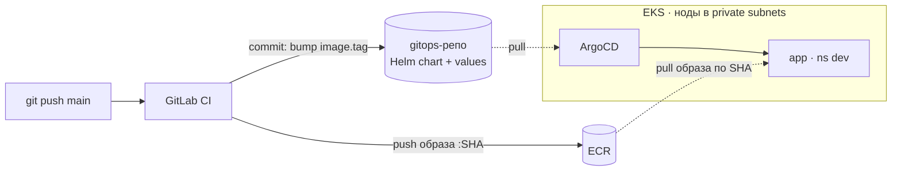

# talk-booking — платформа доставки на AWS/EKS

Полигон, собранный ради практики платформенных решений: один небольшой FastAPI-сервис,
вокруг которого выстроен полный путь от коммита до работающего пода — инфраструктура из
кода, CI, GitOps-доставка. Приложение здесь намеренно простое: предмет работы — не код
сервиса, а то, как он собирается, доезжает до кластера и что происходит, когда это ломается.

Инфраструктура эфемерная: весь стек поднимается и сносится одной командой, поэтому 24/7
ничего не работает — смотреть стоит код, решения и разборы инцидентов.

## Что смотреть в первую очередь

Самое содержательное в репозитории — не манифесты, а обоснования и разборы сбоев.

### Решения (ADR)

| Решение | Суть |
| --- | --- |
| [CI→AWS auth](docs/adr/14-ci-auth-masked-vars.md) | долгоживущий ключ в masked+protected переменных против OIDC federation: почему для этого контура допустимо и почему в проде так не делают |
| [Helm, не Kustomize](docs/adr/15-helm-vs-kustomize.md) | выбор шаблонизации от состава стека, а не от «гибче»; цена решения проговорена |
| [Деплой коммитом в gitops](docs/adr/17-ci-commits-to-gitops.md) | почему у CI нет доступа к кластеру и почему Image Updater расщепляет истину желаемого состояния |
| [Шифрование Secrets в EKS отключено](docs/adr/17-eks-secrets-encryption-off.md) | KMS-ключ против фактической модели угроз эфемерного кластера |

### Разборы инцидентов (postmortems)

| Инцидент | Чему учит |
| --- | --- |
| [Mutable tag](docs/postmortems/14-mutable-tag.md) | тег — перевешиваемый указатель, а не имя образа; «откатись на вчерашний latest» невыполнимо, потому что умирает адрес, а не байты |
| [Дрейф и провалившийся sync в ArgoCD](docs/postmortems/16-argocd-drift-and-sync-failure.md) | три независимые оси состояния; почему схемно-невалидный манифест безопаснее валидного-но-неверного |

Плюс [шпаргалка по exit codes и сигналам](docs/exit-codes.md) — коды выхода, `pipefail`,
где смотреть при падении контейнера.

## Архитектура



**Собрано и работает:** remote state в S3 с нативным локом · VPC на 2 AZ (public/private,
NAT) · EKS с managed node group и включённым IRSA · ECR с immutable-тегами и lifecycle-политикой ·
ArgoCD, поднимаемый терраформом вместе с единственной root Application · пайплайн
lint → test → сборка образа → bump тега в gitops · app-of-apps, auto-sync с selfHeal.

**Ещё не собрано:** RDS и миграции, секреты через External Secrets Operator, ALB с TLS и
DNS, prod-среда с промоушеном через MR, наблюдаемость (Prometheus/Grafana/Loki), HPA,
NetworkPolicy, восстановление из бэкапа.

## Поток доставки

Коммит в `main` запускает пайплайн: линтер, тесты, сборка образа и push в ECR под тегом,
равным SHA коммита. Затем отдельная джоба клонирует gitops-репозиторий, правит в нём
`image.tag` и коммитит — этим и заканчивается участие CI. ArgoCD внутри кластера сам
забирает изменение из git и приводит кластер к нему.

Ключевое свойство: **у CI нет доступа к кластеру** — ни kubeconfig, ни credentials, ни
сетевого пути к API-серверу. Его максимальное право — коммит в один git-репозиторий.
Кластер не принимает деплой извне, а забирает желаемое состояние сам. Отсюда следует, что
тег образа равен хэшу коммита: по работающему поду однозначно восстанавливается, какой код
внутри, а откат — операция над текстом в git, а не над кластером.

## Структура

Два репозитория, разделённые по назначению:

- **этот репозиторий** — приложение, инфраструктура и пайплайн
  - `app/` — FastAPI-сервис, эндпоинт `/health` отдаёт SHA сборки
  - `infra/` — Terraform: backend, VPC, EKS, ECR, bootstrap ArgoCD
  - `.gitlab-ci.yml` — lint → test → build → deploy
  - `docs/adr/`, `docs/postmortems/` — решения и разборы сбоев
- **[talk-booking-gitops](https://gitlab.com/beaviz0405/talk-booking-gitops)** — желаемое
  состояние кластера: Helm-чарт приложения, `values-dev` / `values-prod`, ArgoCD Applications

## Как поднять и снести

```bash
cd infra
terraform init
terraform apply                                          # ~20 минут
aws eks update-kubeconfig --name talk-booking --region eu-central-1
kubectl get applications -n argocd                       # root и app-dev должны быть Synced/Healthy
terraform destroy                                        # в конце работы
```

Подробнее о порядке и слоях стека — в [infra/README.md](infra/README.md).

## Приложение локально

```bash
uv sync
uv run uvicorn app.main:app --reload
curl localhost:8000/health          # {"status":"ok","commit_sha":"unknown"}
uv run ruff check .
```

`commit_sha` берётся из переменной `COMMIT_SHA`; в пайплайне туда уходит SHA коммита.

## Осознанные компромиссы

Стенд учебный, и часть решений отличается от того, как это делают в проде. Отличия
намеренные и задокументированы, чтобы их не приняли за недосмотр:

- **Аутентификация CI в AWS** — долгоживущий ключ IAM-пользователя вместо OIDC federation.
  Пользователь узкий, только push в один ECR-репозиторий. Разбор — в ADR.
- **Две среды в одном кластере** вместо кластера (или аккаунта) на среду — из-за бюджета.
- **Публичный API-эндпоинт кластера** вместо приватного с bastion.
- **Сборка образов через Docker-in-Docker** — требует privileged-контейнера; daemonless-путь
  (BuildKit rootless, Buildah) сознательно отложен.
- **`deletion_protection = false`** на будущих stateful-ресурсах — чтобы `terraform destroy`
  оставался одной командой.

Секретов в git нет ни в одном из репозиториев: всё чувствительное живёт в CI-переменных
(masked + protected), а в перспективе — в Secrets Manager с доставкой через IRSA.
