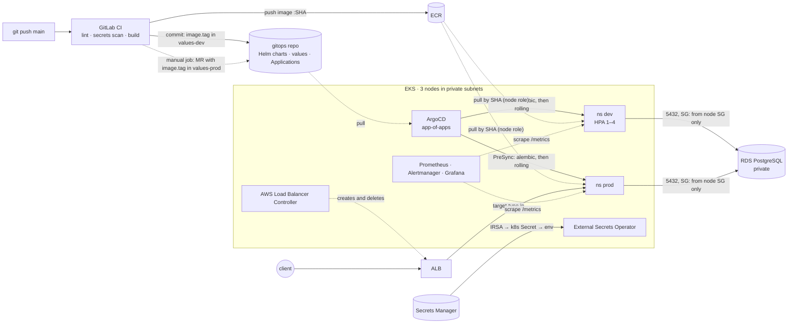

# talk-booking — a delivery platform on AWS/EKS

A training ground for platform engineering: one small FastAPI service, and around it the
full path from a commit to a running pod — infrastructure as code, CI, GitOps delivery,
two environments with promotion, observability and autoscaling. The application is
deliberately simple. The subject is not the service code but how it is built, how it
reaches the cluster, and what happens when that breaks.

The infrastructure is ephemeral: the whole stack is created and destroyed with one
command, so nothing runs 24/7. What is worth reading is the code, the decisions and the
incident write-ups.

## Start here

The most useful part of this repository is not the manifests but the incident write-ups
and the reasoning behind the decisions. Every incident below was induced on a live stand,
captured while broken, and diagnosed from the signal.

### Incidents (postmortems)

| incident | what it teaches |
| --- | --- |
| [Mutable tag](docs/postmortems/14-mutable-tag.md) | a tag is a movable pointer, not an image name; "roll back to yesterday's latest" fails because the address dies, not the bytes |
| [Drift and a failed sync in ArgoCD](docs/postmortems/16-argocd-drift-and-sync-failure.md) | sync, health and operation are independent axes; a schema-invalid manifest is safer than a valid but wrong one |
| [A one-line change that destroys the database](docs/postmortems/19-rds-replace-data-loss.md) | `~` versus `-/+` in a plan; `ForceNew` is a property of an attribute; three RDS protections at three different levels |
| [RDS unreachable, silently](docs/postmortems/20-rds-connectivity-silent-drop.md) | layer-by-layer diagnosis; a timeout cannot tell a route from a filter; `Running` without probes means only "the process exists" |
| [A secret in git history](docs/postmortems/21-secret-in-git-history.md) | deleting the file does not remove the value; rotate at the source first, rewrite history second |
| [A contract migration under live code](docs/postmortems/22-contract-migration-window.md) | the schema must fit both code versions during a rollout; expand/contract is what makes a code rollback possible |
| [Probes: a restart loop and a 502 window](docs/postmortems/25-probes-loop-and-502.md) | `Ready` drives three independent decisions; liveness must not check dependencies |
| [A rollout returns 5xx with healthy pods](docs/postmortems/26-rollout-5xx-graceful-shutdown.md) | pod deletion only starts a notification; measured 0.94 % errors → 0 with `preStop` and an explicit termination budget |
| [A broken release and two rollbacks](docs/postmortems/27-bad-release-and-rollbacks.md) | every gate green while prod fails; an emergency `argocd app rollback` gets undone by the parent Application |
| [A pod that will not start](docs/postmortems/30-pod-gauntlet.md) | four statuses, four actors: who formed the status and in which field the cause lives |
| [HPA vs the database connection budget](docs/postmortems/32-hpa-connection-budget.md) | autoscaling knows only CPU; `maxReplicas × pool` must fit what the database can give |

### Decisions (ADR)

The ADRs are in Russian for now.

| decision | summary |
| --- | --- |
| [CI → AWS auth](docs/adr/14-ci-auth-masked-vars.md) | a long-lived key in masked + protected variables instead of OIDC federation: why it is acceptable here and why production does not do this |
| [Helm, not Kustomize](docs/adr/15-helm-vs-kustomize.md) | the choice follows from the stack (platform components ship as Helm charts), not from "more flexible" |
| [Deploy by committing to gitops](docs/adr/17-ci-commits-to-gitops.md) | CI has no access to the cluster; an image updater would split the source of truth |
| [EKS Secrets encryption off](docs/adr/17-eks-secrets-encryption-off.md) | a KMS key against the actual threat model of an ephemeral cluster |
| [RDS protection flags](docs/adr/19-rds-safety-flags.md) | gates off, safety net (final snapshot) on — for a stand that is destroyed every session |
| [External Secrets Operator, not SealedSecrets](docs/adr/21-eso-vs-sealed-secrets.md) | an external source of truth with rotation; nothing secret in git history |
| [Migrations as an ArgoCD PreSync hook](docs/adr/22-migrations-presync-vs-ci.md) | the deployer guarantees the order; CI cannot reach the private database anyway |
| [Prod auto-sync, merge request as the only entry](docs/adr/27-prod-sync-policy.md) | drift is impossible by construction; the cost is that there is no emergency bypass |

## Architecture


```mermaid
flowchart LR
    DEV[git push main] --> CI[GitLab CI<br/>lint · secrets scan · build]
    CI -->|"push image :SHA"| ECR[(ECR)]
    CI -->|"commit: image.tag in values-dev"| GOPS[(gitops repo<br/>Helm charts · values · Applications)]
    CI -.->|"manual job: MR with image.tag in values-prod"| GOPS
    GOPS -.->|pull| ARGO

    subgraph EKS["EKS · 3 nodes in private subnets"]
        ARGO[ArgoCD<br/>app-of-apps]
        ARGO -->|"PreSync: alembic, then rolling"| DEVNS[ns dev<br/>HPA 1–4]
        ARGO -->|"PreSync: alembic, then rolling"| PRODNS[ns prod]
        ESO[External Secrets Operator]
        ALBC[AWS Load Balancer Controller]
        MON[Prometheus · Alertmanager · Grafana]
    end

    ECR -.->|"pull by SHA (node role)"| DEVNS & PRODNS
    SM[(Secrets Manager)] -->|"IRSA → k8s Secret → env"| ESO
    U((client)) --> ALB[ALB] -->|"target-type ip"| PRODNS
    ALBC -.->|creates and deletes| ALB
    DEVNS & PRODNS -->|"5432, SG: from node SG only"| RDS[(RDS PostgreSQL<br/>private)]
    MON -.->|"scrape /metrics"| DEVNS & PRODNS
```

## Flows

**Deploy to dev (no hands).** A push to `main` runs lint, the secrets scan and the image
build; the image goes to ECR tagged with the commit SHA. A separate job clones the gitops
repository, changes `image.tag` in `values-dev.yaml` and commits. CI's part ends there.
ArgoCD inside the cluster pulls the change: the PreSync hook runs `alembic upgrade`, then
the rolling update starts, gated by readiness.

**CI never touches the cluster.** It has no kubeconfig, no credentials and no network
path to the API server. Its strongest right is a commit to one git repository. The tag
equals the commit SHA, so any running pod maps back to exact code, and a rollback is an
operation on text in git.

**Promotion to prod.** A manual `promote-prod` job opens a merge request that moves the
same SHA — the one already deployed to dev — into `values-prod.yaml`. Merging is the
release. Prod runs automated sync, so the merge request is the only way in.

**Rollback.** The canonical one is `git revert` of the promotion merge; ArgoCD brings prod
back. `argocd app rollback` is refused while automated sync is on, and forcing it by
disabling sync on the child Application does not stick: the parent restores the field
from git within minutes ([postmortem 27](docs/postmortems/27-bad-release-and-rollbacks.md)).
The schema is never rolled back, which is why migrations follow expand/contract.

**Secrets.** RDS generates the master password into Secrets Manager. ESO, authenticated
through IRSA (a projected service account token exchanged in STS for short-lived
credentials, scoped to one secret ARN), copies it into a Kubernetes Secret, which reaches
the pod as an environment variable. There are no secrets in either repository.

**A request.** Client → ALB (public subnets) → a pod address in the target group
(`target-type: ip`, VPC CNI gives pods VPC addresses) → the application → RDS in private
subnets. Three TCP connections, each opened by a different party.

## What is built and what is not

| area | status |
| --- | --- |
| remote state (S3, native lock), VPC, EKS, ECR | built |
| CI: lint, secrets scan, build by SHA, bump in gitops | built; **the test stage is a placeholder** |
| ArgoCD app-of-apps, two environments, promotion by MR, two rollbacks rehearsed | built |
| RDS, secrets via ESO + IRSA, migrations as a PreSync hook | built |
| ALB via the Load Balancer Controller | built; **no TLS or DNS** — HTTP on the ALB name (the TLS part was studied, not built) |
| probes, graceful shutdown | built, measured |
| Prometheus, Alertmanager, Grafana dashboards as JSON in gitops | built; Prometheus without persistent storage |
| HPA with a connection budget | built |
| centralized logs (Loki), NetworkPolicy, restore from snapshot | **not built yet** |

## Known gaps

These are known, written down, and not fixed yet:

- **No tests run in CI.** The `test` stage is `echo "pytest"`. A release that breaks a
  handler passes every gate ([postmortem 27](docs/postmortems/27-bad-release-and-rollbacks.md)).
- **The image referenced by prod has been evicted from ECR.** The lifecycle policy keeps
  the last four images regardless of what is deployed, and dev builds pushed the prod
  image out. Promoted images need their own retention rule.
- **No cause-level alert on database connections.** The symptom alerts stayed quiet while
  the connection budget was exceeded
  ([postmortem 32](docs/postmortems/32-hpa-connection-budget.md)).
- **`AppDown` pages on a scrape failure of one pod,** even when the service is fully up.
  It should fire on zero live targets instead
  ([postmortem 30](docs/postmortems/30-pod-gauntlet.md)).
- **No explicit database `connect_timeout`.** A blocked connection waits for psycopg's
  default of 130 seconds before failing
  ([postmortem 20](docs/postmortems/20-rds-connectivity-silent-drop.md)).

## Recovery objectives

**RPO and RTO have not been measured.** A restore from snapshot has not been rehearsed
yet. What exists: automated backups with a one-day retention window and a final snapshot
on every teardown. Until a restore is actually run and timed, any number here would be a
guess.

## Running it

```bash
cd infra
make up          # ~20 minutes: Terraform creates everything, including ArgoCD and the root Application
make values      # copy the new secret ARN and database host into the gitops values; commit and push them
# ... work ...
make down        # asks once, removes Ingresses and waits for the ALB, destroys, then lists leftovers
make leftovers   # anything still billable in AWS; empty means clean
```

`make status`, `make cost` and `make snapshots` report what is alive, what it has cost so
far, and which final RDS snapshots accumulated. Details are in
[infra/README.md](infra/README.md).

**Cost.** About $0.23 per hour with three `t3.small` nodes, dominated by the EKS control
plane. A forgotten stand costs about $5 a day, so the stand is destroyed at the end of
every session and the remainder is checked with `make leftovers`. The S3 state bucket and
ECR stay and cost cents per month.

## Deliberate trade-offs

This is a training stand, and some choices differ from production on purpose:

- **CI authenticates to AWS with a long-lived IAM user key** instead of OIDC federation.
  The user can only push to one ECR repository. See the ADR.
- **Both environments share one cluster and one database** — for budget. A consequence:
  every dev migration changes the schema under running prod code.
- **The cluster API endpoint is public** instead of private with a bastion.
- **Images are built with Docker-in-Docker**, which needs a privileged container.
- **`deletion_protection = false` on RDS**, so the stand can be destroyed with one
  command; the final snapshot is the safety net.

## Repository layout

Two repositories, split by purpose:

- **this repository** — the application, the infrastructure and the pipeline
  - `app/` — the FastAPI service: `/health` returns the build SHA, `/ready` checks the
    database, `/talks`, `/metrics`
  - `migrations/` — alembic revisions, run by the PreSync hook
  - `infra/` — Terraform: state, VPC, EKS, ECR, RDS, ArgoCD, ESO, the ALB controller,
    the monitoring stack
  - `.gitlab-ci.yml` — lint and secrets scan → test → build → deploy-dev → promote-prod
  - `docs/postmortems/`, `docs/adr/` — incidents and decisions
- **[talk-booking-gitops](https://gitlab.com/beaviz0405/talk-booking-gitops)** — the
  desired state of the cluster: the application chart, per-environment values, ArgoCD
  Applications, dashboards

## The application locally

The application checks the database connection at startup and exits if it cannot
connect — on purpose, so a broken dependency is loud. Locally it needs a PostgreSQL; the
defaults are `localhost:5432`, user `app`, database `talkbooking`.

```bash
docker run -d --name tb-db -p 5432:5432 \
  -e POSTGRES_USER=app -e POSTGRES_PASSWORD=app -e POSTGRES_DB=talkbooking postgres:16
uv sync
DB_PASSWORD=app uv run uvicorn app.main:app --reload
curl localhost:8000/health          # {"status":"ok","commit_sha":"unknown"}
uv run ruff check .
```

`commit_sha` comes from the `COMMIT_SHA` variable; the pipeline sets it to the commit SHA.
